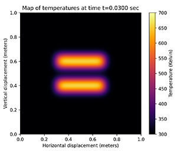
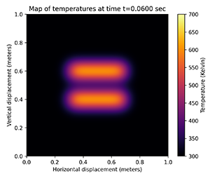
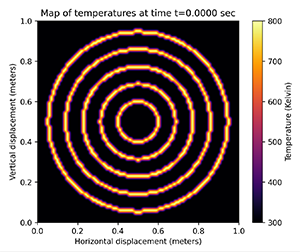

# heatdiffusion 🥵

Heat transfer/diffusion simulation with conduction through uniform 2D mesh.


## Usage

```
pip install -r requirements.txt
```
```
python heatdiffusion/<hd_example>
```
where `<hd_example>` is the remainder file name of the program you want to run.

## Description

A rectangle of conducting material of size (x, y) meters diffuses and temperature fluctuates based on the initial setup and extra conditions.

The system is subdivided into a grid of (m, n) sub-rectangles where each sub-rectangle is approximated as if its temperature is uniform and interacts with its four adjacent neighbors.

Outside the rectangle of material(s) is void, so the system does not lose or gain energy except when a boundary condition is set.

Each element of the mesh (m, n) is assigned an initial temperature, conductivity constant and the simulation is run in time with a constant step integration.

Temperature may be modified from outside the system by the program but this will mean that energy is added or removed from the system.

## Gallery

### Cooling Bars

Two bars given the same uniform temperature cool down with respect to time.






### Source Rings

Concentric rings are given exactly enough energy such that the temperature remains constant with respect to time.




