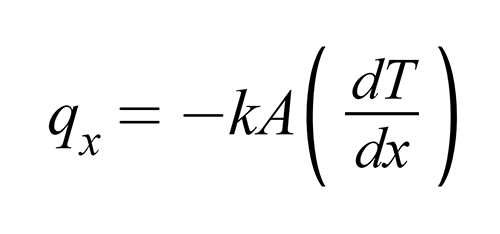
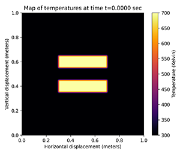

# heatdiffusion 🥵

Heat transfer/diffusion simulation with conduction through uniform 2D mesh.



## Usage

```
pip install -r requirements.txt
```
```
python heatdiffusion/<hd_example>
```
where `<hd_example>` is the remainder file name of the program you want to run.

## Description

A rectangle of conducting material of size (x, y) in meters diffuses and temperature fluctuates based on the initial setup.

The rectangle is subdivided into a grid of (m, n) where each sub-rectangle is assumed as isothermal and is interacting with its four neighbors.

Outside the material is void, so the material does not interact with the outside.

Each element of the mesh (m, n) is assigned an initial temperature and conductivity and is simulated in time with a constant step to observe the effects.

Temperature may be modified from outside the system by the user but this will mean the energy of the system changes.

## Gallery

### Cooling Bars

Two bars filled in with the same temperature cool down with time.




### Source Rings

Concentric rings are given a temperature that remains constant as the simulation moves on.


